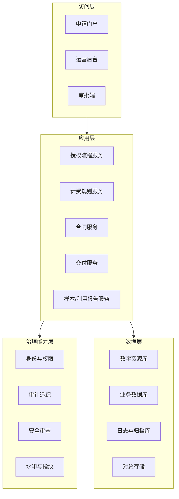

# 03 - 总体架构

## 1. 架构目标
- 支撑授权业务全流程线上化。
- 满足“统一管理、分级开放、全程审计”的治理要求。
- 将制度规则转化为系统可执行规则。

## 2. 架构原则
1. 制度驱动：流程、权限、计费和交付受规则引擎约束。
2. 数据主权：原始数据集中管理，按最小权限开放。
3. 安全闭环：申请、审批、下载、对外发布均有可追溯证据。
4. 渐进建设：优先模块化单体，达到规模后再服务化拆分。

## 3. 逻辑架构

## 4. 核心模块
### 4.1 授权流程服务
- 申请受理、节点流转、超时催办、状态回退。
- 支持简易/标准/重大三级流程模板。

### 4.2 计费规则服务
- 内置分类计费规则（学术、出版、展览、文创、视频等）。
- 支持期限系数、用途折扣、人工议价审批。

### 4.3 合同服务
- 根据审批结果生成合同草案。
- 管理签署版本、条款快照、补充协议。

### 4.4 交付服务
- 按合同规格生成交付包。
- 下载链接时效控制、次数限制、水印注入。

### 4.5 报告服务
- 样本上传（出版样书/实体样品登记）。
- 利用报告上传（展览场景图、视频、说明）。

## 5. 数据架构要点
- 资源元数据与文件分离管理。
- 原始数据仅内网可见，外发数据采用衍生版本。
- 保留资源版本、交付批次、合同映射关系。
- 关键日志（审批、下载、导出）不可篡改归档。

## 6. 集成接口
- 支付系统：支付状态回调、对账。
- 电子签章：合同签署与验签。
- 财务系统：开票、收款、退款。
- 统一身份认证：内部与外部账号治理。

## 7. 部署建议
- 一期：模块化单体 + 分层数据库，降低复杂度。
- 二期：按授权流程、计费、交付、审计逐步拆分服务。
- 全程启用灰度发布和规则版本管理，避免规则改动引发历史订单偏差。
