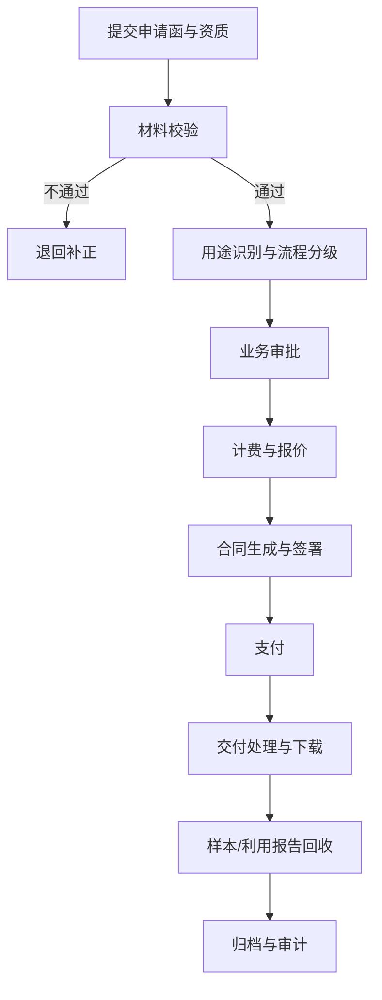

# 04 - 关键业务流程

## 1. 对外授权主流程

## 2. 流程分级
| 流程类型 | 触发条件 | 审批链路 |
| :--- | :--- | :--- |
| 简易流程 | 学术研究、小额标准化申请 | 运营初审 -> 自动计费 |
| 标准流程 | 出版、展览、常规传播 | 运营初审 -> 主管复审 -> 财务确认 |
| 重大流程 | 文创、品牌相关、高价值视频/展项 | 运营 -> 专项评审 -> 法务 -> 领导审批 -> 财务 |

## 3. 申请受理标准
### 3.1 必备材料
- 申请函（用途、载体、期限、范围、资源目录）
- 主体资质（个人身份证明或单位营业资质）
- 联系与结算信息（付款方、发票信息）
- 特殊用途补充材料（如文创定价与发行计划）

### 3.2 一致性校验
- 申请方、签约方、付款方一致性校验。
- 不一致时触发三方合同流程。

## 4. 计费与合同流程
1. 按用途与规格自动计算基准费用。
2. 命中协商项（超阈值印量、特殊期限、展项包干）进入人工议价。
3. 报价确认后生成合同。
4. 合同签署后锁定交付规格与数量。

## 5. 交付与履约
- 交付前置条件：合同生效 + 支付确认。
- 交付方式：限时下载链接或项目交付包。
- 履约约束：署名要求、禁止超范围使用、禁止再授权。

## 6. 履约后管理
- 样本管理：出版物/实物至少 2 份样本登记。
- 利用报告：展览或线上展示需提交场景证据。
- 违规处置：暂停授权、证据固化、合同追责。

## 7. 关键SLA建议
- 材料初审：2个工作日内。
- 标准审批：5个工作日内。
- 交付生成：支付确认后2个工作日内。
- 争议响应：1个工作日内受理。
