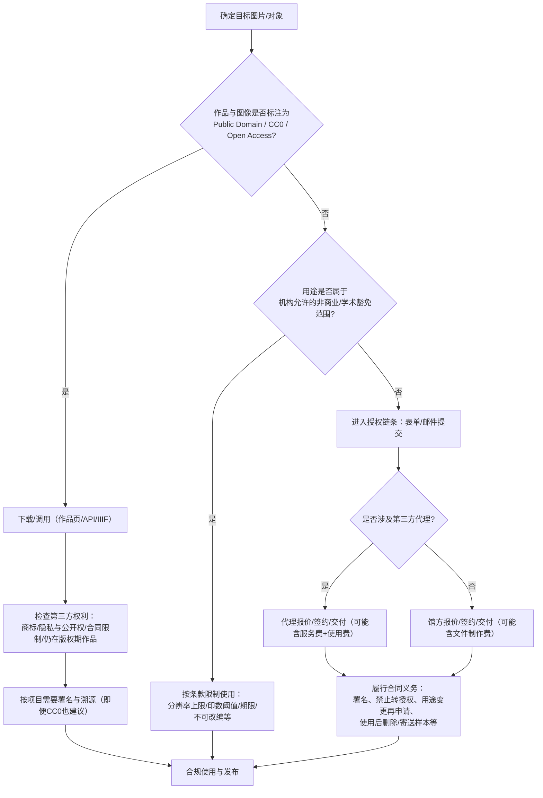

# 国际主要博物馆图片对外授权政策与实施情况深度研究报告

## 执行摘要

本报告对17家具有代表性的国际博物馆/馆群（覆盖英、法、德、荷、美、西、意、梵蒂冈等不同法律体系与治理结构）之“馆藏图片对外授权政策与实施情况”进行对比研究，重点围绕：开放程度（公共领域/CC0/CC授权/非商业限制等）、可获得资源规格（分辨率/格式/元数据/下载方式）、许可条款（商业/非商业/教育/学术/改编/署名/再许可限制）、收费与计费逻辑、第三方代理（如代理机构、流程差异、合同要点）、实施与合规（可获取性、障碍与典型争议）、以及法律与政策背景（版权法、公共领域判定、博物馆权利声明）展开。结论与建议面向研究者、教育机构、媒体机构及博物馆管理者。

结论上，可以观察到三类主流模式并存：  
其一是“公共领域+CC0/无障碍高分辨率”开放模式，以美国大型机构为典型（例如大都会艺术博物馆、史密森尼、华盛顿国家美术馆、盖蒂），多在其“认为属于公共领域”的范围内直接提供可商用的高分辨率图片，不收取使用许可费，也通常不要求事前许可，仅提示第三方权利风险。citeturn17view1turn19view0turn17view3turn13view1turn18view0  
其二是“部分开放（多为非商业/学术豁免）+商业收费”混合模式，典型分布于英国与部分欧洲机构：对低分辨率开放（常见CC BY-NC-ND或CC BY-NC-SA），高分辨率或商业用途进入收费/审核/合同流程；并且“商业”的定义可能被扩张到学术出版、教材、期刊等，从而显著提高合规复杂度。citeturn9view2turn22view1turn12view1  
其三是“以收费授权为主、并强调控制（禁止裁切/改编/转授权/使用后删除文件等）”的传统权利管理模式，典型如普拉多与乌菲齐：不仅对图片供给（扫描/摄影/文件制作）收费，更对“出版/传播/展示/数字产品/衍生品”等使用场景按发行量、期限、地域、语言等维度计费，条款细密、合规义务重。citeturn20view1turn20view0turn20view2  

在法律与政策层面，欧盟《数字单一市场版权指令》强调公共领域视觉艺术作品的“忠实复制件”不应被新的版权或相关权利重新封闭（但并不禁止文化机构出售复制品/服务），对欧洲机构的政策演进具有方向性影响；美国判例对“二维公有领域作品的精确复制照片”之原创性门槛更为严格，亦支撑了美国机构大规模采用CC0开放策略。citeturn28search4turn28search2  

## 研究方法与范围

研究对象选取遵循三项标准：  
一是具有可公开检索的图片授权/使用政策（含官方条款、开放获取页面、费率表或申请表）；二是覆盖不同地域与法律体系（普通法、欧陆法、美国联邦机构与基金会/私立机构、意大利文物法体系、梵蒂冈特殊法域）；三是兼顾“开放获取先锋”和“传统收费授权代表”，以便对照。核心对象包括：英国（大英博物馆、伦敦国家美术馆、维多利亚与阿尔伯特博物馆）、法国（卢浮宫、巴黎市立博物馆体系Paris Musées、奥赛）、德国（柏林国家博物馆体系/博物馆岛相关）、荷兰（荷兰国立博物馆）、美国（大都会艺术博物馆、史密森尼、华盛顿国家美术馆、盖蒂、芝加哥艺术学院、纽约现代艺术博物馆）、西班牙（普拉多）、意大利（乌菲齐）、梵蒂冈（梵蒂冈博物馆）。citeturn17view0turn31view0turn23view0turn19view0turn20view1turn20view2turn20view3  

数据采集以“官方页面与原始政策文件”为主，包括：网站条款（Terms of Use/Legal notice）、开放内容/开放获取（Open Access/Open Content）、图像服务/图片库条款、费率表PDF、申请表PDF、以及对外发布的新闻稿/说明；辅以高质量学术与行业研究（Kress基金会资助的图像许可研究、Ithaka案例研究、JCMS论文、OpenGLAM Survey等）用于解释制度背景与实施争议。citeturn6search0turn6search1turn6search6turn6search3  

执行时间线：本次检索与交叉核对集中完成于2026-02-21（America/Los_Angeles），以该时点可公开访问内容为准；各馆政策可能随开放获取策略、基金资助、版权/文物法规修订而更新，报告在“数据来源清单”中列明关键政策入口，便于后续复核。citeturn18view0turn26view0turn28search4  

## 横向比较与总体趋势

下表按用户要求对17家机构在五项指标（开放程度、是否收费、是否提供高分辨率、是否委托代理、典型费用区间）进行横向对比。费用区间以官方费率表/条款为准；若官方未公开具体金额，则标注“未公开（按用途报价/需询价）”。

| 覆盖机构（17家） | 开放程度（公共领域/CC0/CC/限制） | 是否收费（常见场景） | 是否提供高分辨率（在线或可申请） | 是否委托代理（示例） | 典型费用区间（官方公开口径） |
|---|---|---|---|---|---|
| entity["organization","大英博物馆 The British Museum","museum | london, uk"] | 非商业：大量图片以CC BY-NC-SA 4.0开放；商业：需另行许可 | 非商业下载/申请服务：不收费；商业用途：收费、需许可 | 提供：在线至750px；免费申请可至2500px；商业可按预算/用途提供更高 | 商业许可由BM Images（馆方图片库）承接 | 新摄影/扫描与交付费用有公开表（如£60–£85/张等），许可费依用途报价（未统一公开）citeturn9view1turn9view0turn37view0 |
| entity["organization","卢浮宫 Musée du Louvre","museum | paris, france"] | 网站照片：RMN署名照片可非商业再用；馆藏库：对“未受版权保护作品”的中等格式照片在限定教育/学术目的下免费再用，其他用途需付费申请 | 限定学术/教育目的可免费；商业及超出范围用途：付费、走RMN流程 | 馆藏库提供可下载（需接受条款）；JSON文档显示图片URL为JPG（含original缓存路径） | 与entity["organization","RMN–Grand Palais Photo（Rmn-GP）","photo agency | paris, france"]相关：商业/编辑用途联系其摄影机构 | 费率“按RMN现行标准”但未在馆藏库条款中列明具体金额（未公开）citeturn10view0turn31view0turn32view0 |
| entity["organization","巴黎市立博物馆 Paris Musées","museum network | paris, france"] | 公共领域2D作品高清数字文件以CC0开放，强调“无技术/法律/财务限制”，可商业再用 | 免费、不收取使用费 | 提供：每次包含HD图片（标注300dpi、3000px）及作品信息文档 | 未体现外包代理；并提供API获取 | 0 | citeturn27view0 |
| entity["organization","奥赛博物馆 Musée d'Orsay","museum | paris, france"] | 网站作品复制件：严格限非商业用途；商业/出版需授权，并指向RMN获取照片印制与出版授权 | 非商业可用；出版/商业需授权（并可能收费） | 未在法务页披露参数；指向RMN获取照片印制 | 与RMN体系关联 | 未公开 | citeturn27view1 |
| entity["organization","大都会艺术博物馆 The Metropolitan Museum of Art","museum | new york, us"] | “认为属公共领域”的作品图片以CC0开放、可不受限再用；非开放/受限作品需另行申请 | Open Access：免费；受限图片：通过代理收取费用 | 明确提供大量hi-res；并给出可识别OA图标 | entity["organization","Art Resource, Inc.","image licensing agency | new york, us"]为主要代理，承接受限/不可得图片的许可请求 | Open Access：0；受限图片：按用途计费（未公开统一价），新摄影可能需额外费用且至少6周 | citeturn17view1turn17view2 |
| entity["organization","史密森尼 Smithsonian Institution","museum network | washington, dc, us"] | Open Access资产以CC0投入公共领域，可自由复制/改编/商业使用；非CC0内容标注“usage conditions apply”并限制商业使用 | CC0：免费；非CC0商业用途需事前书面许可 | 覆盖数百万2D与3D数字资产；提供开发者工具与API入口 | 未体现外包代理为主；强调商标不在开放范围 | 0（CC0部分）；非CC0商业许可费用未在FAQ中统一披露 | citeturn13view2turn19view0turn19view1 |
| entity["organization","华盛顿国家美术馆 National Gallery of Art","museum | washington, dc, us"] | 对“推定处于公共领域”的馆藏图片实行Open Access，CC0、可商用；并说明非开放的原因类型 | Open Access：不收取使用/许可/访问费；额外成像服务可收处理费 | 提供大量可下载；并有影像服务部门 | 未体现第三方代理为主 | 0（Open Access）；额外影像服务：可收处理费（具体金额未公开） | citeturn17view3turn18view0 |
| entity["organization","伦敦国家美术馆 The National Gallery","museum | london, uk"] | 低分辨率馆藏图：CC BY-NC-ND 4.0；学术出版高分辨率可申请“Scholarly Waiver”（短印数/开放期刊等）；其他高分辨率通常收费 | 低分辨率免费；学术豁免可减免/免收；其他用途收费 | Scholarly Waiver明确：高分辨率、最大A5 300dpi；并强调色彩校准一致性 | 商业图片库网站承接许可与付费（National Gallery Images） | Scholarly Waiver：0或折扣；商业/其他：未公开（按用途报价） | citeturn22view1turn36view1 |
| entity["organization","维多利亚与阿尔伯特博物馆 Victoria and Albert Museum","museum | london, uk"] | 网站内容允许部分学术/非营利使用，但对图像尺寸、期限、比例有多重限制；商业用途需联系其图像许可团队并收费 | 非商业在条件内可用；商业（含>4000印数等）收费 | 低清下载：最长边768px；商业/专业用途可申请更高（通过V&A Images） | 由V&A内部图像许可团队/其商业图片库承接（V&A Images） | 未公开（按用途/印数/地域/期限等信息处理与报价） | citeturn12view0turn12view1turn6search1 |
| entity["organization","荷兰国立博物馆 Rijksmuseum","museum | amsterdam, netherlands"] | 大量馆藏图片可免费高分辨率下载；并要求署名/来源标注 | 免费为主；若无法提供现成图像可收费供给 | 在线作品页：JPEG平均4500×4500；专业用途可申请免费高分辨率TIFF（含色卡/颜色参考） | 未体现外包代理为主（自有照片服务） | 0为主；特殊“找不到/需另供”的情况收费（金额未在页面列明） | citeturn17view0 |
| entity["organization","柏林国家博物馆 Staatliche Museen zu Berlin","museum network | berlin, germany"] | 以CC授权为通用机制，目标“尽可能公共领域标注”；Public Domain Mark可无限制再用；部分为CC BY-SA等；版权受限则按权利人许可 | 公共领域/开放许可部分可直接再用；版权受限图像需另行许可（可能产生制作/供给成本） | 新门户提供可下载高分辨率并支持缩放；更高分辨率可向馆所申请 | 对持有版权的图像，条款明确指向bpk代理；并要求不加码限制（契合开放许可精神） | 公开条款未给出统一价格；bpk为“按使用类型计费+可能有下载/处理费”机制 | citeturn12view2turn23view0turn39view0 |
| entity["organization","普拉多博物馆 Museo Nacional del Prado","museum | madrid, spain"] | 以“非独占许可合同+严格使用义务”为主；免费从主站下载被允许于特定个人/学术/非营利情形，但大量“下载排除/限分辨率”条款存在 | 多数出版/数字/展示/衍生品用途收费；并按语言/地域/期限/发行量递增；超范围可收3倍费用 | 图片库支付后提供数字文件；数字使用场景可限定分辨率（示例：640×480@72dpi）；并可另收更高分辨率文件制作费 | 自有Image Bank负责商业管理；并提示在版权期内需另向集体管理组织取授权 | 公开费率表：如学术≤500册内页€71.5/张、封面€132/张；并有摄影新拍费用、展示/数字/衍生品等多类价目 | citeturn20view0turn24view0turn25view1turn20view1 |
| entity["organization","乌菲齐美术馆 Gallerie degli Uffizi","museum | florence, italy"] | 以意大利文物法框架下的“使用许可/征收”模式为主；区分图像供给费与出版权利费 | 对学生/学者供给有低收费档；科研/科学出版（≤1000发行）可免收“出版权利费”但仍可能存在供给费 | 申请表显示可提供TIF格式与出版权利；可通过服务器/光盘等交付 | 未体现外包代理为主（馆内档案与许可部门） | 公开申请表列明：供给费学生/学者€10（存档已拍）/€35（新拍），其他用户€30/€100；出版权利费按发行量阶梯（如≤1000科研免收；非科学出版与更高发行收费） | citeturn20view2turn26view0 |
| entity["organization","盖蒂 J. Paul Getty Trust","museum trust | los angeles, us"] | Open Content：公共领域作品高清图以CC0开放、无使用限制与费用；同时保留对非开放图像的收费服务与费率表 | Open Content：0；非开放/需服务处理：有价目表（区分学术/非营利、商业、发行量、用途等） | Open Content为高分辨率可下载；费率表亦明确出版用途通常提供高分辨率TIFF | 未体现外包代理为主（馆方权利与复制部门管理） | 公开费率表：学术/非营利出版（≤5000册）内页$15，商业出版内页$75–$200等；并有网站/数字应用、展陈、处理费等条目 | citeturn13view1turn36view2 |
| entity["organization","芝加哥艺术学院 Art Institute of Chicago","museum | chicago, us"] | 标注“CC0 Public Domain Designation”的图像可免费用于任何目的（含商业）；并以API方式开放数据（CC0） | CC0部分：0；其他图像许可与服务可能收费/需处理费（对外页面摘要提及“modest processing fee”等） | API配置提供IIIF入口，支持高质量图像调用；具体最大像素需以单件资源为准 | 对非开放图像许可，公开摘要提及通过Art Resource等渠道的许可与限制 | 0（CC0部分）；非开放部分费用未形成统一公开费表（常见为处理费+用途计费） | citeturn16view1turn15search0turn35search6turn5search5 |
| entity["organization","纽约现代艺术博物馆 The Museum of Modern Art","museum | new york, us"] | 以“许可申请+代理执行”为主（未见同等规模CC0开放声明） | 许可通常收费（由代理执行） | 高分辨率由代理提供（来自馆方影像工作室） | 北美由Art Resource；其他地区由entity["organization","Scala Archives（Scala Group S.p.A.）","image licensing agency | florence, italy"] | 未公开（按用途与地区/代理规则计费） | citeturn13view3 |
| entity["organization","梵蒂冈博物馆 Vatican Museums","museum | vatican city"] | 网站内容（含图片）声明为梵蒂冈城国治理机构专有财产，禁止复制与传播 | 原则上禁止对外复制传播（至少就网站发布材料而言） | 未提供对外高清开放口径 | 未体现第三方代理；以禁止性声明为主 | 未公开 | citeturn20view3 |

总体趋势与解释框架：  
第一，开放获取的“法律表达”高度依赖标准化开放许可（尤其CC0），用于向公众清晰传达“可自由使用”的边界；而混合模式与传统模式往往通过“用途分类+合同义务”实现风险控制与收入回收。citeturn19view0turn17view1turn20view0turn36view2  
第二，欧洲机构尤其是法国体系中，国家级摄影/图像机构（RMN–Grand Palais）在商业与出版授权链条中扮演重要角色，且其帮助文档明确将“即便作品已进入公共领域”的图像仍纳入“按用途收费”的再利用逻辑，体现了“服务/制作成本回收+权利管理”并行的制度惯性。citeturn11search6turn10view0turn31view0  
第三，德国机构在近年强调以CC许可、Public Domain Mark以及FAIR/CARE原则强化透明度与可再用性，同时仍保留对“版权受限图像”通过bpk等渠道的商业化与权利清算路径，形成“开放标注+分层供给”的组合。citeturn12view2turn23view0turn39view0  

## 重点个案研究

以下对每家机构按用户要求的七个维度逐项说明（政策摘要、资源规格、许可条款、收费、委托授权、实施与合规、法律与政策背景）。为避免重复，机构名称不再逐次附表格实体名，但均对应上表同一对象。

大英博物馆：  
政策摘要：馆方明确区分“非商业（Creative Commons）”与“商业（BM Images许可）”。大量标注为© Trustees of the British Museum的图片在非商业情境下以CC BY-NC-SA 4.0提供。citeturn9view1turn9view2  
授权资源规格：非商业可直接下载至750px/72dpi；通过“免费图片服务”可申请至2500px/300dpi并在24小时内邮件发送；商业用途图片的尺寸/分辨率取决于用途与预算。citeturn9view1turn9view0  
授权类型与许可条款：CC BY-NC-SA要求署名、非商业、相同方式共享；馆方对“商业”给出扩展性清单（例如将教材、学术书刊、甚至某些免费活动的宣传等纳入“商业活动”范畴），显著影响学术出版与教育传播的合规判断。citeturn9view2  
收费与计费：非商业不收费；商业许可需询价。另有公开的摄影/数字成像服务费用表：例如新摄影2D £60/张、3D £85/张；并说明交付为高分辨率JPEG（约3500px长边、Adobe RGB 1998、适合A4@300dpi），既有图像交付亦可能收取£10–£25等“交付费（可从许可费中抵扣）”。citeturn37view0turn9view0  
委托授权：商业使用由BM Images承接（馆方图片库体系）。citeturn9view0turn37view0  
实施与合规：线上路径清晰（收藏数据库“Use image”按钮+邮件交付）；但合规难点集中在“商业定义”的宽口径与学术出版边界，需在项目早期确认用途属性与期刊/出版社的再许可条款兼容性。citeturn9view2turn9view1  
法律/政策背景：以版权与知识产权法为基础，馆方强调并非网站全部内容可用CC许可，原因包括第三方权利与文化敏感性等。citeturn9view2  

卢浮宫：  
政策摘要：卢浮宫网站法律信息区分照片署名来源：署名“© Musée du Louvre”类照片被视为卢浮宫的专有内容；署名“© RMN, Musée du Louvre”照片归RMN所有，非商业再用被允许（需标注来源与作者），但商业/编辑用途需联系RMN摄影机构。citeturn10view0  
授权资源规格：馆藏数据库提供“Download image”，并在“Terms of Use”中将可下载对象限定为“未受版权保护作品的中等格式照片”；同时其JSON文档显示图片字段通常提供JPG的原图与缩略图URL以及版权署名字段，便于自动化获取元数据与图片链接（但使用仍受条款限制）。citeturn31view0turn32view0  
授权类型与许可条款：馆藏库条款对“免费再用”列出穷尽清单，例如：馆务/教育/科学活动投影与分发；在欧盟注册地出版社范围内发行不超过1500册的展览/常设馆藏图录、科学论文与博士论文；数字科学与教育出版等；并要求保留摄影署名与作品条目永久链接。超出范围（尤其商业、衍生品、影音/多媒体、其他印刷品）需向RMN提交书面申请并付费。citeturn31view0  
收费与计费：超出免费范围的用途“按RMN现行费率收费”，具体金额未在条款中给出。citeturn31view0turn10view0  
委托授权：商业/编辑用途明确指向RMN–Grand Palais摄影机构。citeturn10view0turn31view0  
实施与合规：对学术与教育用途给出相对可操作的“免费再用边界”（含发行量与EU注册地限制）；对AI训练用途亦在网站法律信息中通过权利人团体条款表达限制倾向（涉及ADAGP名录作品）。citeturn10view0turn31view0  
法律/政策背景：条款明确区分“照片作为摄影作品”的权利与“原作（仍受版权保护时）”的权利清算，提醒用户需自行向权利人取得许可。citeturn31view0  

Paris Musées（巴黎市立博物馆体系）：  
政策摘要：Paris Musées自2020年起将约15万件公共领域作品的高清数字复制件作为Open Content发布，强调“无费用、无任何技术/法律/财务限制”，无论商业与否均可再用，并以CC0实现权利放弃。citeturn27view0  
授权资源规格：每次下载包含HD图片（标注300dpi、3000px）、作品信息文档与良好实践章程（建议署名与溯源）。并提供API以获取高清图片与相关信息。citeturn27view0  
许可条款：CC0意味着不要求署名、不限制改编与商业使用，但章程层面鼓励引用来源。citeturn27view0  
收费：0。citeturn27view0  
委托授权：未见以第三方代理为主的公开口径。citeturn27view0  
实施与合规：对仍在版权期的作品仅提供低清用于在线展示，体现“版权分层供给”。citeturn27view0  
法律/政策背景：通过“公共领域作品+CC0”的组合，将公共领域判定与再用许可标准化、可机器识别。citeturn27view0  

奥赛博物馆：  
政策摘要：奥赛（及橘园）网站法律声明明确其网站内容受法国知识产权法保护；作品复制件仅授权“严格非商业目的”使用；照片印制与出版需授权并指向RMN摄影机构。citeturn27view1  
资源规格与流程：未在该法务页披露可下载的尺寸/格式参数；但公开路径清楚指向RMN。citeturn27view1  
许可条款与收费：出版与商业使用需要授权；费用未公开。citeturn27view1  
委托授权：与RMN体系关联。citeturn27view1  
合规要点：相较Paris Musées的CC0开放，奥赛体现了法国体系内部的“开放程度差异化”，是理解法国图像再利用生态的关键对照。citeturn27view0turn27view1  

大都会艺术博物馆：  
政策摘要：Open Access自2017年实施，对其“认为处于公共领域或已放弃其可能拥有版权”的作品图片以CC0开放，可不受限制地下载、共享、再混合，且“无费用”。citeturn17view1  
资源规格：公开声明提供超过40万张hi-res图片；通过作品页OA图标识别；并提供开放数据（CSV/GitHub更新）供研究与开发，但不含图片本体。citeturn17view1turn17view2  
许可条款：CC0意味着允许商业/非商业、改编与再分发；对不在OA范围的作品，需遵循代理许可。citeturn17view1  
收费：OA范围为0；受限或不可得图片由Art Resource承接并收费，且新摄影可能需额外费用且至少6周；馆方保留拒绝权。citeturn17view1turn17view2  
委托授权：Art Resource作为主要代理，承接全球外部许可请求。citeturn17view1turn17view2  
实施与合规：OA图标+作品页下载是低摩擦体验；受限作品则转入“表单—代理审核—报价—交付”的传统链条，形成明显分层。citeturn17view1turn17view2  
法律背景：以“公共领域判定+CC0放弃”的方式降低跨国再利用的不确定性，但仍提醒第三方权利问题。citeturn17view1turn17view3  

史密森尼：  
政策摘要：Open Access明确将数百万数字资产（2D/3D）以CC0投入公共领域，用户可立即下载、分享、再用，无需申请；并强调其使命“知识的增长与传播”。citeturn13view2turn19view0  
资源规格：覆盖21家博物馆及研究中心等；提供开发者工具、3D平台与API，并将CC0标识作为可机器识别的使用信号。citeturn13view2turn19view0  
许可条款：FAQ与Terms of Use持续强调：CC0仅针对版权，第三方权利（商标、隐私、公开权等）仍可能存在；非CC0内容“usage conditions apply”，商业用途需事前书面许可。citeturn19view0turn19view1  
收费：CC0为0；非CC0商业许可费用未统一公开。citeturn19view0turn19view1  
委托授权：未见以图像代理为主的公开表述；对商品化与影视等商业请求给出内部联络路径。citeturn19view1  
实施与合规：标识清晰、路径直接；合规重点转向第三方权利自查与避免商标误导（例如不得暗示官方背书）。citeturn19view0turn19view1  
法律背景：通过CC0明确权利放弃，降低“许可文化”对再利用的摩擦（学术研究亦指出开放策略对公共获取与创新的潜力）。citeturn19view0turn6search12  

华盛顿国家美术馆：  
政策摘要：对其“认为处于公共领域”的馆藏图片实施Open Access（CC0），用户无需联系即可免费用于商业或非商业目的，并解释不开放的常见原因（版权不明、隐私、非完全所有权、合同限制、尚未摄影等）。citeturn17view3  
资源规格：可直接从作品页下载；开放数据（CSV/GitHub）每日更新，数据集含媒体链接但不含媒体文件本体。citeturn18view0  
收费：对Open Access图片不收取使用/许可/访问费；但对额外影像服务（新拍、格式化等）可收取处理费以回收成本。citeturn18view0  
合规：馆方提示其仅能就自身权利给出许可，不保证第三方不会在其他国家主张权利，体现跨境再用风险提示。citeturn17view3turn18view0  

伦敦国家美术馆：  
政策摘要：通过“公共任务声明”将再利用类别制度化：低分辨率馆藏图免费再用（并指向CC BY-NC-ND 4.0）；学术出版可申请Scholarly Waiver使用高质量数字图；其他高分辨率通常收费并通过商业图片库渠道提供。citeturn22view1turn36view1  
资源规格：Scholarly Waiver明确高分辨率图片最大A5 300dpi，且强调其色彩校准体系使跨图像色彩比较更可靠（对学术出版质量敏感）。citeturn36view1  
许可条款：CC BY-NC-ND限制商业与改编；Scholarly Waiver按个案审批，并对印数（<1000实体册）与开放期刊等用途给出范围描述。citeturn22view1turn36view1  
收费：低分辨率免费；Scholarly Waiver可豁免或折扣；商业/其他用途未给出统一公开价目。citeturn36view1turn22view1  
委托授权：通过National Gallery Images承接高分辨率商业许可。citeturn22view1turn36view1  
实施与合规：以“公共任务—可再用类别—对应入口”组织信息，透明度较高；主要合规难点在于ND条款对细节裁切、版式改动、二次创作等实践的限制。citeturn22view1turn36view1  

维多利亚与阿尔伯特博物馆：  
政策摘要：网站条款对不同非商业/学术/非营利使用给出许可边界，但设置了较多限制（例如图像尺寸A5与768px上限、使用期限、内容占比不超过25%、封面/主页/展陈等转为商业条件），商业用途需联系其图像许可团队并收费。citeturn12view0turn12view1  
资源规格：低分辨率可右键保存；数字发布最长边768px；商业与专业用途由图像许可团队处理（并可包含新摄影/再扫描）。citeturn12view1turn12view0  
许可条款：对第三方内容要求用户自行清权；并规定署名格式（如“© Victoria and Albert Museum, London”）。citeturn12view1  
收费：条款明确“我们是商业图片库并收费”，但未公开统一价目，需要提供标题、印数、地域、期限等信息以报价。citeturn12view1  
委托授权与实施：Ithaka案例研究显示V&A Images作为机构内部商业许可部门，长期面临“公共使命与许可收入模型”的张力，是理解英国机构混合模式的重要案例。citeturn6search1turn6search5  
法律背景：在“网站内容许可”层面对非商业用途开放，但通过尺寸与用途限制控制风险与商业替代。citeturn12view1  

荷兰国立博物馆：  
政策摘要：明确“免费订购高分辨率图片（Order high resolution images free of charge）”，多数作品页可直接免费下载JPEG；并鼓励将名作用于演示、空间装饰等。citeturn17view0  
资源规格：在线下载JPEG平均4500×4500；专业用途可免费申请高分辨率TIFF并带色彩参考；强调持续升级质量并建议避免复用旧文件。citeturn17view0  
许可条款：强调署名“Rijksmuseum, Amsterdam”，并希望获得出版样本。citeturn17view0  
收费：大多数免费下载/申请免费；若库中无图可“收费提供”，需通过表单与邮件沟通，金额未公开。citeturn17view0  
实施：路径极简（作品页直接下载+表单申请TIFF），是开放获取落地体验的标杆之一。citeturn17view0  

柏林国家博物馆体系（含博物馆岛相关馆所）：  
政策摘要：公开条款以CC许可为核心授权机制；“一般努力”以公共领域标注为目标，并明确Public Domain Mark与CC BY-SA等许可的再用范围（可分享、可改编、可商用），同时对版权受限图片标注权利人并要求另行许可。citeturn12view2turn23view0  
资源规格：新门户提供高分辨率图像，支持缩放并可下载，且计划提供API；更高分辨率可向具体馆所申请。citeturn23view0  
许可条款：强调不得通过额外条款/技术措施限制开放许可已允许的行为；并提出引用建议（作者/标题/永久链接/摄影署名/许可类型/是否改动）。citeturn12view2turn23view0  
收费：公开条款未统一披露；但当图像属于基金会（SPK）版权且需许可时，条款指向bpk，且可能产生新数字拷贝制作与许可成本。citeturn12view2turn39view0  
委托授权：条款明确对“SPK拥有版权的受限图像”联系bpk；bpk通用条款显示其采用一次性用途许可、要求使用后删除数字文件、并可对高分辨率文件检索/传输收取下载与处理费用。citeturn12view2turn39view0  
实施与合规：2022年公告强调“放宽公共领域作品复制件的使用条件、逐步将复制件上架至Wikimedia Commons”，并在页面逐步更新署名与许可信息，体现“政策—标注—平台分发”的持续治理过程。citeturn23view0turn12view2  
法律/政策背景：与德国版权法修订及基金会Open Science Policy相关联；并引入CARE原则处理原住民语境数据的伦理治理。citeturn23view0turn12view2  

普拉多博物馆：  
政策摘要：图片库以“商业管理”定位对外许可：许可为非独占、绑定产品形态（媒介）、目的、地域、期限与发行量；超范围可要求支付三倍费用并可终止许可。citeturn20view0  
资源规格：费率表针对“授权下载/数字使用/展览展示/衍生品/拍摄新照片”等细分；并出现“数字使用仅可限分辨率再现（如640×480@72dpi）”“更高分辨率文件制作费”等条款，显示其将“文件制作/分辨率”纳入收费对象。citeturn25view1turn24view2turn20view1  
许可条款：许可文本要求图像“忠实再现”，禁止裁切、覆盖、扭曲等；细节图需预审；使用后需销毁/删除文件；并要求署名“© Photographic Archive Museo Nacional del Prado”。此外，对仍处版权期（作者逝世未满70年等）的作品，需另向集体管理组织/权利代理取得许可（如VEGAP、DACS、ADAGP等），由申请者自担。citeturn20view0  
收费：公开费率表较为细致。例如：学术≤500册内页€71.5、封面€132，含两种语言与无限地域、许可期至发行结束；并对多语言、再版、地域扩展、数字伴随使用等设置加价比例；另有新摄影半天€550/一天€1100等项目。citeturn24view0turn20view1  
委托授权：由其Image Bank体系（Museo Nacional del Prado Difusión等）承接商业管理与交付。citeturn20view0turn20view1  
实施与合规：强合同化、强控制（删除义务、禁止改编/裁切、超用惩罚性收费）是其合规难点；对媒体、数字出版与衍生品开发者，需要在设计阶段锁定用途参数以避免成本飙升。citeturn20view0turn20view1  
法律背景：在欧陆法体系中，公共机构对复制件与数字文件的管理常与“成本回收/公共资源再利用规则/文化政策”交织，学术研究亦指出公共领域复制件的封闭化会引发伦理与法理争议。citeturn6search6turn28search4  

乌菲齐美术馆：  
政策摘要：明确其图像“许可与收费”依据意大利《文化遗产与景观法典》（D.Lgs. 42/2004）第107–108条及文化部关于最低收费标准的部长令（DM 108/2024等），并由馆内部门处理“促销与商业目的”的许可请求。citeturn26view0turn20view2  
资源规格：申请表明示提供TIF格式数字图像与出版权利；交付方式包括服务器传输与光盘等；并禁止将图像/权利转让第三方。citeturn20view2  
许可条款：区分“仅供图像供给+出版权利”与“仅出版权利（申请者已持有图像）”；衍生用途需另联系许可部门；并要求向馆方图书馆提供出版样本。citeturn20view2turn26view0  
收费：申请表公开列明供给费与出版权利费：学生/学者存档已拍€10、新拍€35；其他用户存档已拍€30、新拍€100；科研或科学出版且发行<1000可免收出版权利费；非科学出版与更高发行量对应€50、€150等阶梯，并对高质量/高发行另行评估。citeturn20view2  
委托授权：未见第三方代理为核心的公开链条，更多体现“馆内档案+馆内许可部门”双线。citeturn20view2turn26view0  
实施与合规：流程清晰（指定邮箱+表格），但本质仍是“许可审批+收费征收”模式；对国际出版项目需额外考虑银行手续费、印花税等细节条款。citeturn20view2  
法律背景：意大利以文物法优势管理文化资产再利用，与美国/荷兰的“公共领域+CC0开放”形成强对照。citeturn26view0turn28search2  

盖蒂：  
政策摘要：Open Content Program自2013年起对盖蒂馆藏中公共领域作品的高分辨率图像以CC0开放，可免费用于商业与非商业且无使用限制；并定期扩展开放数量。citeturn13view1  
资源规格：Open Content为高分辨率可下载；同时其“Collection Image Fees”价目表明确出版用途通常提供高分辨率TIFF（数字应用则为屏幕优化），并可通过Hightail电子交付。citeturn36view2  
许可条款：CC0开放不要求许可；但价目表也强调“提供数字图像不等同于授予或否认版权许可”，权利清算责任仍在请求者（尤其对在版权期作品）。citeturn36view2turn13view1  
收费：Open Content为0；价目表对非开放图像与服务给出细分价格（学术≤5000册内页$15，商业出版内页$75–$200，封面/跨页更高；网站/数字应用、展陈、影视亦有条目；复杂订单可$50/小时处理费）。citeturn36view2  
委托授权：以馆方权利与复制部门为主导。citeturn36view2turn13view1  
实施与合规：对用户而言，首先判断是否为Open Content图像；若不是，则进入可预测的价目表体系，透明度在“收费机构”中较高。citeturn36view2turn13view1  

芝加哥艺术学院：  
政策摘要：其公开口径显示：标注“CC0 Public Domain Designation”的图像可免费用于任何目的（含商业与非商业），与其开放获取战略一致；并通过公共API开放数据。citeturn15search0turn16view1  
资源规格：API文档明确返回数据以CC0发布，并提供IIIF服务URL配置，意味着可通过IIIF按需获取尺寸/区域/格式等图像派生版本。citeturn16view1turn29search2  
许可条款：CC0适用于被标注为CC0的图像与数据；非CC0资源需遵循网站条款与许可流程。citeturn16view1turn15search0  
收费与代理：公开摘要提到对非开放图像许可可能通过代理/处理费机制运行（例如“scholarly/academic publications多免费但可能有处理费”，或通过Art Resource链条提供许可与限制）。citeturn35search6turn5search5  
实施与合规：开放图像的合规成本极低；非开放部分则回到传统许可文化。对开发者而言，IIIF与API降低了检索与批量使用门槛，但仍需以作品级许可标识为准。citeturn16view1turn29search2  

纽约现代艺术博物馆：  
政策摘要：以“授权请求交由地区代理处理”为核心：北美由Art Resource，其他地区由Scala Archives，代理提供高分辨率数字文件并处理许可。citeturn13view3  
资源规格：明确高分辨率文件来自馆方影像工作室并由代理供应；若代理站点未展示目标图像，可邮件请求。citeturn13view3  
许可条款与收费：未在该页披露统一价目，通常为按用途报价、一次性用途许可；并按地区代理规则执行。citeturn13view3  
委托授权：Art Resource与Scala为明确代理，体现“全球分区代理”实施结构。citeturn13view3  
合规：对媒体/出版项目需尽早启动许可流程，避免因代理清权、合同条款、交付周期影响出版排期（学界对许可文化导致的延迟与成本亦有持续讨论）。citeturn6search8turn13view3  

梵蒂冈博物馆：  
政策摘要：其网站版权声明采取强禁止性立场：网站发布的画册、图片、文字等材料为梵蒂冈城国治理机构专有财产，禁止全部或部分复制与传播。citeturn20view3  
资源规格、收费与代理：该声明未提供开放下载或对外授权的具体参数与费率入口；对外使用可能需通过另行渠道协商（报告在此仅陈述网站公开声明层面）。citeturn20view3  
合规：对研究者与媒体而言，风险在于“即便原作可能为公共领域，仍需处理机构对其数字复制件/网站材料的权利主张与合同限制”，也是学术界讨论“公共领域复制件封闭化（copyfraud等）”时常见的难题类型之一。citeturn20view3turn6search6turn6search2  

## 法律与政策背景

公共领域与“忠实复制件”的再封闭问题：在欧盟层面，《数字单一市场版权指令》序言与条款强调：公共领域视觉艺术作品的某些复制件不应因为复制行为而再产生新的版权/相关权利壁垒，同时也明确这不妨碍文化机构售卖复制品（例如明信片）或通过服务回收成本。citeturn28search4turn28search11  
该方向与学界、行业对“公共机构对公共领域作品复制件主张权利”的争论相呼应：JCMS论文指出博物馆常在公共领域作品图像上采取限制性政策，并提出其不仅是法律问题，也是博物馆伦理与公共使命问题。citeturn6search6  

美国法域的原创性门槛与开放策略：美国联邦地区法院在Bridgeman v. Corel等案件中对“对公有领域二维作品的精确复制”是否具备版权保护所需的原创性进行了否定性判断，这一判例逻辑常被视为美国机构推行CC0开放获取的法理支撑之一（尽管具体政策仍取决于机构治理、风险偏好与商业模式）。citeturn28search2turn17view3  

“公共部门信息再利用”监管对英国机构的影响：伦敦国家美术馆在公共任务声明中直接引用英国《公共部门信息再利用条例》（RPSI）框架，列明哪些类别可免费再用、哪些通常收费，体现公共法框架对再利用透明度的推动。citeturn22view1turn28search3  

意大利文物法体系与“许可征收”模式：乌菲齐明确其商业/促销用途的图像许可依据D.Lgs 42/2004第107–108条与文化部最低收费指导文件（DM 108/2024等），这使其图像再利用更接近“文化资产使用许可”而非单纯版权许可，并形成对供给与出版权利分拆收费的结构。citeturn26view0turn20view2  

第三方权利与合规责任的持续存在：即使机构以CC0开放，馆方通常仍强调第三方权利风险（隐私/公开权、商标、合同限制、作品本身仍在版权期等），用户需自行评估并清权。史密森尼与华盛顿国家美术馆均在条款中强调其不对第三方权利作担保。citeturn19view1turn17view3turn18view0  

## 结论与建议

对研究者与高校/出版社：  
在选图阶段应建立“许可分层决策”流程：先优先使用明确CC0/公共领域标识的开放资源（如史密森尼、华盛顿国家美术馆、大都会、盖蒂、Rijksmuseum、Paris Musées），以显著降低成本与周期不确定性；对混合模式机构（大英博物馆、伦敦国家美术馆、V&A、卢浮宫馆藏库）则需尽早判定用途是否会被视为“商业”（尤其注意“教材/学术图书/付费期刊/发行量阈值”等），并检查期刊/出版社要求的开源许可证是否与馆方NC/SA/ND条款冲突。citeturn9view2turn22view1turn31view0turn36view1turn19view0  
对需要大量插图的学术项目，可优先选择“透明价目表”机构（如盖蒂、普拉多）或“学术豁免机制”机构（伦敦国家美术馆Scholarly Waiver、大英博物馆对论文/免费教育讲座等的非商业例示），并在项目管理中显式留出清权与交付周期。citeturn36view2turn24view0turn9view2turn36view1  

对媒体与内容产业（纪录片/出版/数字产品/衍生品）：  
需将“授权条款对产品设计的约束”前置到创意阶段。例如普拉多禁止裁切/改编、细节图需审批、并对数字产品的语言/期限/传播媒体附加费，使得后期改版与多平台分发成本可能显著上升；乌菲齐则强调禁止转授权与用途变更须再批准。citeturn20view0turn24view2turn20view2  
同时应建立“第三方权利清算清单”（作者仍在版权期、集体管理组织、商标、隐私/公开权等），即便使用CC0资源也不应忽视；史密森尼与国家美术馆均以条款形式提醒此点。citeturn19view1turn17view3  

对博物馆管理者与政策制定者：  
开放获取策略的关键不在于“是否完全免费”，而在于“可预期、可机器识别、可规模化”：清晰的作品级权利标注（Public Domain Mark/CC0/CC BY等）、统一的元数据与永久链接、以及API/IIIF等技术接口，会显著降低机构的个案处理负担并扩大传播影响；Berlin与Paris Musées在“许可标注+下载+API”方面展示了系统化路径。citeturn23view0turn27view0turn12view2turn29search2  
如果仍需通过收费回收成本，建议向“服务费与使用费拆分、公开价目表、学术/非营利减免机制”演进：盖蒂的费率表提供了较高透明度的参考，普拉多亦展示了用途分层的精细化，但其强控制条款可能增加公共使命争议；相关学术研究与行业报告建议将“许可文化”对研究与教育的摩擦成本纳入治理评估。citeturn36view2turn20view1turn6search0turn6search8turn6search6  
在欧盟法框架下，Article 14对公共领域复制件的再封闭提出限制方向，机构应评估在成员国实施差异下的跨境合规与风险沟通，并将权利主张更多定位为“服务成本回收”而非“新版权”。citeturn28search4turn28search14turn11search6  

## 数据来源清单与参考文献

### 执行时间线与数据来源说明（概览）

```text
2026-02-21（America/Los_Angeles）
1) 抽样选馆与政策入口定位：各馆官方“Terms/Legal/Images/Open Access/Fees”等页面
2) 逐馆提取：许可类型、可下载规格、申请流程、费率表/申请表、代理信息
3) 交叉核对：学术与行业报告（Kress/Crews、Ithaka、JCMS、OpenGLAM等）用于解释制度差异
4) 汇总输出：比较表 + 个案条目化分析 + 法律背景 + 建议
```

### 各馆关键官方来源（可访问链接）

```text
British Museum – Images and photography:
https://www.britishmuseum.org/terms-use/copyright-and-permissions/images-and-photography

BM Images – Fees for service (PDF):
https://www.bmimages.com/pdfs/fees-for-service.pdf

Louvre – Legal information and terms of use:
https://www.louvre.fr/en/legal-information-and-terms-of-use

Louvre Collections – Terms of Use:
https://collections.louvre.fr/en/page/cgu

Louvre Collections – JSON documentation:
https://collections.louvre.fr/en/page/documentationJSON

Paris Musées – Open content (CC0, HD, API):
https://www.parismusees.paris.fr/en/news/open-content-150000-works-from-the-museum-collections-of-the-city-of-paris-freely-available

Musée d'Orsay – Legal notice:
https://group.musee-orsay.fr/legal-notice.html

The Metropolitan Museum of Art – Image and Data Resources (Open Access CC0 + Art Resource):
https://www.metmuseum.org/policies/image-resources

Smithsonian – Open Access:
https://www.si.edu/openaccess
https://www.si.edu/openaccess/faq
https://www.si.edu/termsofuse

National Gallery of Art (Washington) – Open Access policy & Free images:
https://www.nga.gov/terms-and-notices
https://www.nga.gov/artworks/free-images-and-open-access

The National Gallery (London) – Statement of Public Task:
https://www.nationalgallery.org.uk/about-us/organisation/policies/statement-of-public-task

National Gallery Images (London) – Scholarly Waiver request form:
https://www.nationalgalleryimages.co.uk/media-request-form/

Victoria and Albert Museum – Website terms & image use:
https://www.vam.ac.uk/info/va-websites-terms-conditions

Rijksmuseum – Image requests:
https://www.rijksmuseum.nl/en/research/image-requests

Staatliche Museen zu Berlin – Rights and Terms of Use:
https://www.smb.museum/en/open-science/use/
https://www.smb.museum/en/whats-new/detail/collections-online-open-access-wikimedia-commons-the-staatliche-museen-zu-berlin-expands-its-online-content/

Museo Nacional del Prado – Licence agreement & tariffs:
https://www.imagebankmuseodelprado.com/en/license-agreement/
https://www.imagebankmuseodelprado.com/documents/TARIFAS_ENG.pdf

Gallerie degli Uffizi – Promotional and commercial purposes:
https://www.uffizi.it/en/professional-services/photo-rights-reproductions
Uffizi – EN Request Form (PDF):
https://uffizi-production-b8df82a1.s3.eu-central-1.amazonaws.com/production/attachments/1608106032120039/EN_Request-Form.pdf

Getty – Open Content Program:
https://www.getty.edu/projects/open-content-program/
Getty – Collection Image Fees (PDF):
https://www.getty.edu/legal/image_request/fees_schedule.pdf

Art Institute of Chicago – API documentation (CC0 + IIIF config):
http://api.artic.edu/docs/

MoMA – Licensing (Art Resource / Scala):
https://www.moma.org/collection/about/licensing

Vatican Museums – Copyright:
https://www.museivaticani.va/content/museivaticani/en/copyright.html
```

### 学术论文、政策分析与行业报告（优先原始/学术/官方）

```text
Kress Foundation / Kenneth D. Crews – Copyright, Museums, and Licensing of Art Images (PDF):
https://bmmweb.blob.core.windows.net/kressmedia/media/kress/media/resources/sponsored%20research/crews_copyright_museums_licensingartimages.pdf

Ithaka S+R – V&A Images case study (PDF):
https://sr.ithaka.org/wp-content/uploads/2015/08/SCA_BMS_CaseStudy_V-AImages.pdf

JCMS (Journal of Cultural Management and Policy) – “The Public Domain vs. the Museum”:
https://jcms-journal.com/articles/jcms.1021217

Smithsonian (Kapsalis, 2016) – The Impact of Open Access on GLAM (PDF):
https://siarchives.si.edu/sites/default/files/pdfs/2016_03_10_OpenCollections_Public.pdf

Open GLAM Survey:
https://survey.glamelab.org/

EU – Directive (EU) 2019/790 (PDF):
https://eur-lex.europa.eu/legal-content/EN/TXT/PDF/?uri=CELEX%3A32019L0790

WIPO Lex – Directive (EU) 2019/790 (Article 14 excerpt pages):
https://www.wipo.int/wipolex/en/legislation/details/18927

Bridgeman Art Library v. Corel (Justia):
https://law.justia.com/cases/federal/district-courts/FSupp2/36/191/2413183/

UK – The Re-use of Public Sector Information Regulations 2015 (legislation.gov.uk):
https://www.legislation.gov.uk/uksi/2015/1415/contents

Creative Commons / Open licensing models report (2025) (PDF):
https://creativecommons.org/wp-content/uploads/2025/06/Open-Licensing-Models-Report_CREATe_CC.pdf
```

### 授权流程示意（Mermaid）



（该流程图的关键分叉与义务项基于多馆公开条款的共同结构抽象而来，例如：CC0开放路径（史密森尼/大都会/盖蒂/国家美术馆）、非商业限制与分辨率上限（大英博物馆/V&A/普拉多）、代理介入（大都会/MoMA/柏林体系）、以及使用后删除与一次性用途许可（普拉多/bpk条款等）。citeturn19view0turn17view1turn36view2turn20view0turn39view0